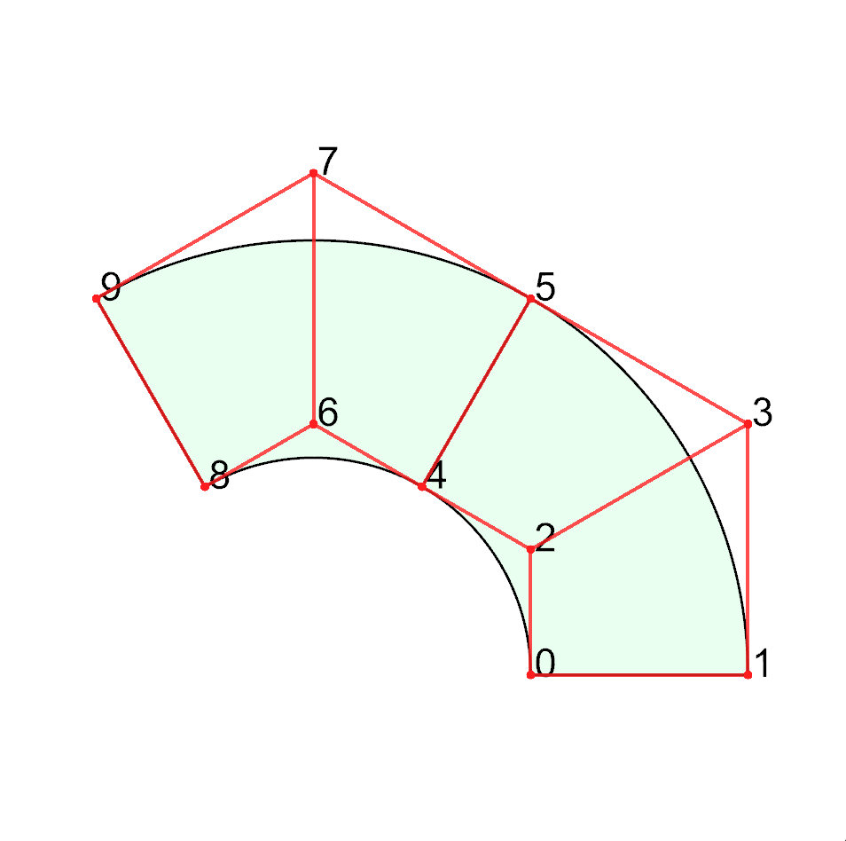

# Visualizing Splines
As a new feature SplinePy now also has the ability to directly plot splines. The splines are plotted with the `vedo` library.

The following will give a brief introduction into basic spline creation and visualization.

## Creating a basic NURBS
For example here we will be creating a hollow disk of 120 degrees explicitly as a
NURBS.
```python
import splinepy

# create a 2D NURBS disk and visualize
nurbs = splinepy.NURBS(
    degrees=[1, 2],
    knot_vectors=[[0, 0, 1, 1], [0, 0, 0, 1, 1, 2, 2, 2]],
    control_points=[
        [5.00000000e-01, 0.00000000e00],
        [1.00000000e00, 0.00000000e00],
        [5.00000000e-01, 2.88675135e-01],
        [1.00000000e00, 5.77350269e-01],
        [2.50000000e-01, 4.33012702e-01],
        [5.00000000e-01, 8.66025404e-01],
        [0.00000000e00, 5.77350269e-01],
        [0.00000000e00, 1.15470054e00],
        [-2.50000000e-01, 4.33012702e-01],
        [-5.00000000e-01, 8.66025404e-01],
    ],
    weights=[
        [1.0],
        [1.0],
        [0.8660254],
        [0.8660254],
        [1.0],
        [1.0],
        [0.8660254],
        [0.8660254],
        [1.0],
        [1.0],
    ],
)

nurbs.show()
```


## Creation of common geometries

You might think well this is a lot of code and you are right, that is
why splinepy provides powerful functions to create splines on the fly. To show
this next the same geometry is created with a single command.
```python
easy_disk = splinepy.helpme.create.disk(
    outer_radius=1,
    inner_radius=0.5,
    angle=120,
    n_knot_spans=2,
)

gus.show(
    ["Handmade disk", nurbs],
    ["Easy disk", easy_disk],
)
```

That was much easier. Feel free to peruse the helpful functions in `splinepy.helmpe`.

## Expanding into 3D
You can also extrude and revolve spline with the build in Creator class.

```python
extruded = nurbs.create.extruded(extrusion_vector=[0, 0, 1])
revolved = nurbs.create.revolved(axis=[1, 0, 0], angle=70)

gus.show(
    ["Extruded NURBS", extruded],
    ["Revolved NURBS", revolved],
)
```


This does not need to be only from 2D->3D but can also be from 1D->2D etc.

This is just the beginning of what you can do with the given plotting and creation capabilities in this library. Please look into the [examples folder](https://github.com/tataratat/splinepy/tree/main/examples) to see more capabilities.


## Notebook plotting

You can also plot your splines inside a notebook. For this you need to change the vedo backend to 'k3d'. To do this you need to add the following lines to the top of the notebook.

```
import vedo

vedo.settings.default_backend = "k3d"
```

After this most functionality of the normal plotting should be available to you. Please write a detailed Issue if you find something that you can plot in a script but not in a notebook. An example notebook is provided in the `gustaf` repository at [ipynb examples](https://github.com/tataratat/gustaf/tree/main/examples/ipynb).
