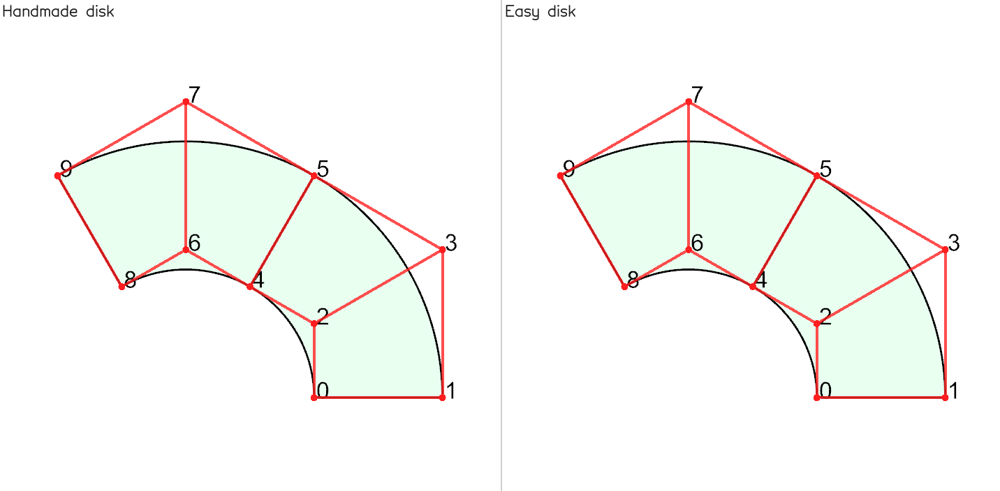

# Visualizing Splines
As a new feature SplinePy now also has the ability to directly plot splines. Currently only `vedo` is available as plotting library.

The following will give a brief introduction into basic spline creation and visualization.

## Creating a basic NURBS
For example here we will be creating an arc of 120 degrees explicitly as a
NURBS.
```python

# create a 2D NURBS disk and visualize
nurbs = gus.NURBS(
    degrees=[1, 2],
    knot_vectors=[
        [ 1.        ,  0.59493748],
        [ 1.        ,  0.59493748],
        [ 0.5       ,  0.29746874],
        [ 0.5       ,  0.29746874],
        [ 0.47715876,  0.87881711],
        [ 0.47715876,  0.87881711],
        [ 0.23857938,  0.43940856],
        [ 0.23857938,  0.43940856],
        [-0.04568248,  1.16269674],
        [-0.04568248,  1.16269674],
        [-0.02284124,  0.58134837],
        [-0.02284124,  0.58134837],
        [-0.54463904,  0.83867057],
        [-0.54463904,  0.83867057],
        [-0.27231952,  0.41933528],
        [-0.27231952,  0.41933528],
    ],
    weights=[
        [1.        ],
        [1.        ],
        [1.        ],
        [1.        ],
        [0.85940641],
        [0.85940641],
        [0.85940641],
        [0.85940641],
        [1.        ],
        [1.        ],
        [1.        ],
        [1.        ],
        [0.85940641],
        [0.85940641],
        [0.85940641],
        [0.85940641],
        [1.        ],
        [1.        ],
        [1.        ]
        [1.        ]
    ]
)
nurbs.show()
```


## Easier with `revolve`

You might think well this is a lot of code and you are right, that is
why gustaf provides powerful functions to create splines on the fly. To show
this next the same geometry is created with a single command.
```python
easy_arc = gus.spline.create.disk(1, 0.5, 120, 2)

gus.show(
    ["Hardcoded Arc", *nurbs_showable.values()],
    ["Easy Arc", *easy_arc_showable.values()],
)
```

Is that not much better. Feel free to peruse the helpful functions in `splinepy.spline.create`.

## Expanding into 3D
You can also extrude and revolve spline with the build in Creator class.
<!--```python
# extract / sample using Extractor helper class
# they are all "show()"-able
nurbs_as_faces = nurbs.extract.faces(resolutions=[100, 50])
@@ -142,35 +218,26 @@ boundaries = nurbs.extract.boundaries()  # list of boundary splines
subspline = nurbs.extract.spline(
    {0: [.4, .8], 1: .7}  # define range dimension-wise
)
```-->

```python
extruded = nurbs.create.extruded(extrusion_vector=[0, 0, 1])
revolved = nurbs.create.revolved(axis=[1, 0, 0], angle=70)

gus.show(
    ["Extruded NURBS", extruded],
    ["Revolved NURBS", revolved],
)
```


This does not need to be only from 2D->3D but can also be from 1D->2D etc.

This is just the beginning of what you can do with the given plotting and creation capabilities in this library. Please look into the [examples folder](https://github.com/tataratat/splinepy/example) to see more capabilities.